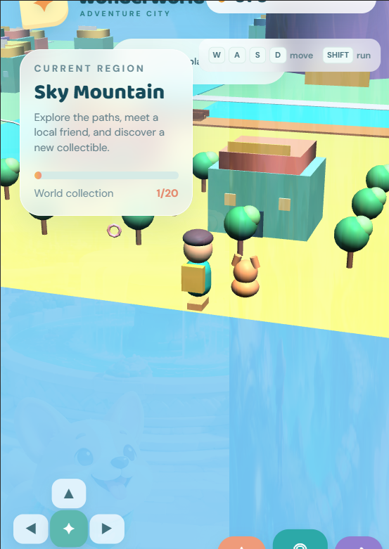
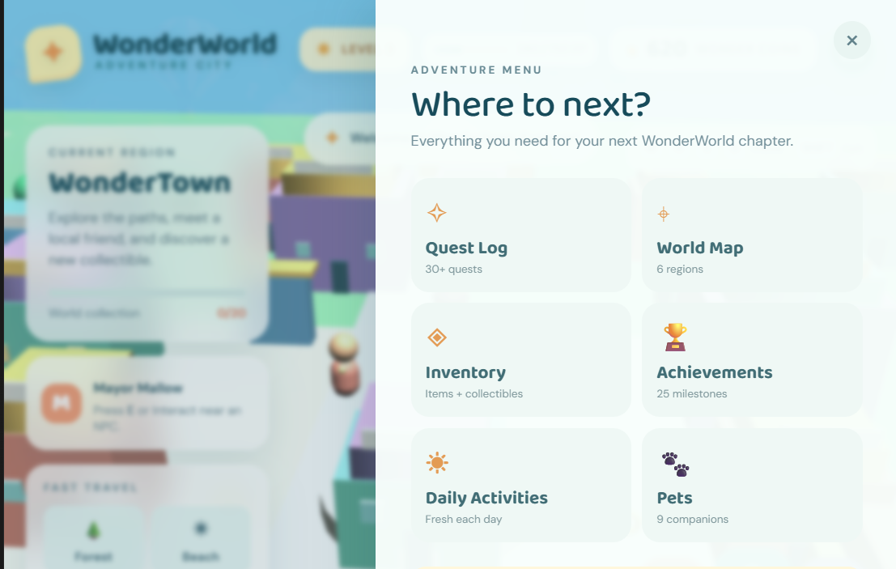
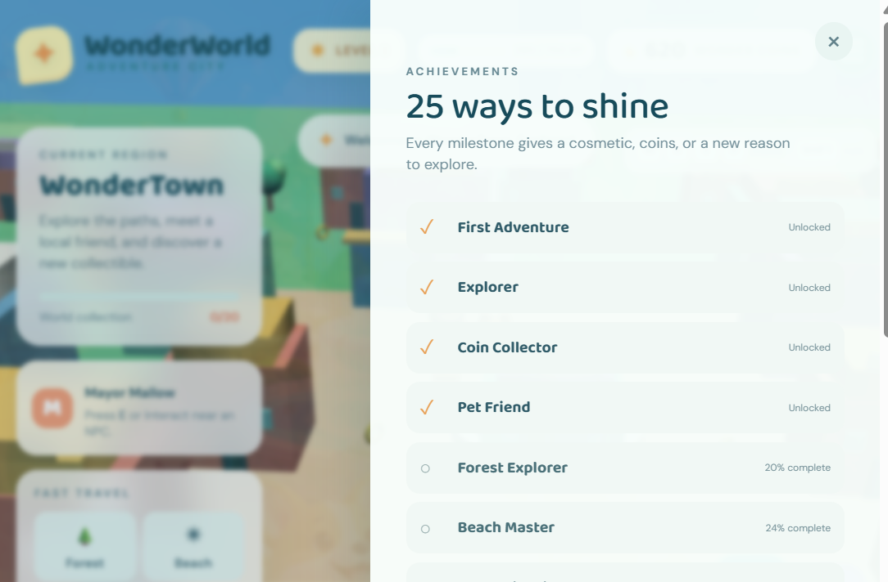

# 🌍 WonderWorld: Adventure City

A beautiful 3D browser-based adventure sandbox game built with React, Babylon.js, and TypeScript. Explore a vibrant multi-region world, collect treasures, complete quests, and unlock new areas as you progress!

  

## 📸 Screenshots

### Explore the World

*Explore Sky Mountain and interact with NPCs in the vibrant 3D world*

### Main Menu & Navigation

*Access Quest Log, World Map, Inventory, Achievements, Daily Activities, and Pet Roster*

### Unlock Achievements

*Complete 25+ milestones to unlock cosmetics, coins, and new reasons to explore*

---

## ✨ Features

### 🗺️ **Expansive Connected World**
- **100m × 76m** fully connected 3D sandbox world
- **6 unique regions** to explore:
  - **WonderTown** - Central hub with 30+ distinct buildings, fountain square, and NPCs
  - **Adventure Forest** - Dense trees, temple, cave, and ranger station
  - **Sunny Beach** - Boardwalk, pier, and tropical paradise
  - **Sky Mountain** - Snow-capped peaks and observatory
  - **Fun Park** - Ferris wheel, arcade, and racing tracks
  - **Mystery Valley** - Gated region with glowing flora and ancient ruins (unlocks at Level 10)

### 👤 **Character & Progression**
- **Level progression** (1-50) with XP and rewards
- **4 collectible types**: Wonder Coins, Stars, Shells, Crystals, and Gems
- **Character customization** - Outfit styling and appearance
- **Pet companions** - Follow and interact with your pet
- **Achievement system** - 25+ achievements to unlock
- **Daily activities** - Complete daily challenges for rewards

### 🎮 **Core Gameplay**
- **Third-person exploration** with ArcRotate camera
- **Smooth movement controls** - Keyboard + mobile touch pad
- **Sprint & jump mechanics** for dynamic traversal
- **NPC interactions** - Dialogue with 15+ named NPCs
- **Quest system** - 30+ quest entries tracking your adventures
- **Mini-games** - 5 replay-able mini-game loops
- **Fast travel system** - Teleport between discovered locations
- **Day/night cycle** - Dynamic lighting and atmosphere
- **Home decoration** - Customize your home
- **Inventory system** - Manage collectibles and items

### 💾 **Persistent Save System**
- **LocalStorage integration** - Save progress automatically on your device
- **Profile tracking** - Level, XP, coins, collectibles, unlocked regions
- **Cross-session persistence** - Your progress stays with you

### 📱 **Cross-Platform**
- **Desktop optimized** - Full 3D experience in your browser
- **Tablet ready** - Touch controls and responsive design
- **Mobile friendly** - Responsive UI with touch controls
- **No installation required** - Play directly in your browser

### 🎨 **Visual Style**
- **Low-poly aesthetic** - Friendly, accessible 3D art style
- **Pastel color palette** - Teal, coral, mint, warm yellow, and lavender
- **Safe for all ages** - Child-friendly design with no violence
- **Discoverable world** - Every region feels unique and alive with details

## 🚀 Getting Started

### Prerequisites
- Node.js 16+ 
- pnpm 10.4.1+

### Installation

1. **Clone the repository**
```bash
git clone https://github.com/hussnainahmedd/wonderworld-adventure-city.git
cd wonderworld-adventure-city
```

2. **Install dependencies**
```bash
pnpm install
```

3. **Start development server**
```bash
pnpm run dev
```

The game will be available at `http://localhost:5173` (or the URL shown in your terminal).

### Build for Production

```bash
pnpm run build
pnpm run start
```

This creates an optimized production build and starts the Express server.

## 📁 Project Structure

```
wonderworld-adventure-city/
├── client/                 # React frontend
│   ├── src/
│   │   ├── components/     # React components (UI panels, GameCanvas)
│   │   ├── game/           # Babylon.js game scene (scene.ts)
│   │   ├── pages/          # Page components
│   │   ├── hooks/          # Custom React hooks
│   │   ├── contexts/       # React contexts
│   │   ├── lib/            # Utility functions
│   │   └── index.css       # Tailwind styles
│   └── index.html
├── server/                 # Express server (index.ts)
├── shared/                 # Shared constants
├── PLAN.md                 # Project roadmap and scope
├── STRUCTURE.md            # Architecture documentation
├── ASSETS.md               # Asset details
└── package.json
```

### Key Files

- **`client/src/game/scene.ts`** - Core Babylon.js scene, world generation, player physics, NPC AI, and game logic
- **`client/src/components/GameCanvas.tsx`** - React wrapper, HUD panels, UI controls, and state management
- **`client/src/components/Map.tsx`** - Interactive world map
- **`server/index.ts`** - Express server for production builds

## 🛠️ Available Scripts

| Script | Description |
|--------|------------|
| `pnpm run dev` | Start development server with hot reload |
| `pnpm run build` | Build for production |
| `pnpm run start` | Run production server |
| `pnpm run preview` | Preview production build locally |
| `pnpm run check` | Type check with TypeScript |
| `pnpm run format` | Format code with Prettier |

## 🎨 Technology Stack

### Frontend
- **React 19.2** - UI framework
- **Babylon.js 9.26** - 3D rendering engine
- **Tailwind CSS 4.1** - Styling
- **TypeScript 5.6** - Type safety
- **Framer Motion** - Animations
- **Vite 7.1** - Build tool
- **Radix UI** - Accessible component primitives

### Backend
- **Express.js** - Node server
- **ESBuild** - JavaScript bundler

### State Management
- **React Hooks** - Local component state
- **LocalStorage** - Persistent client-side storage
- **Custom event bridge** - DOM/Babylon communication

## 🎮 Gameplay Guide

### What You Can Do

The game offers rich exploration and progression mechanics:
- **Explore Regions** - Discover 6 unique areas with their own landmarks and challenges
- **Collect Items** - Find Wonder Coins (1/20 visible in Sky Mountain), Stars, Shells, Crystals, and Gems
- **Complete Quests** - Talk to NPCs to receive quests and unlock story content
- **Level Up** - Gain XP to progress from Level 1 to 50
- **Unlock Content** - Level up to access new regions like the mysterious Mystery Valley
- **Customize** - Decorate your home and personalize your character

### Controls

**Desktop:**
- **WASD** - Move around
- **Space** - Jump
- **Shift** - Sprint
- **E** - Interact with NPCs/objects
- **Tab** - Toggle map
- **Esc** - Open pause menu

**Mobile:**
- **On-screen joystick** - Movement
- **Jump button** - Jump
- **Sprint button** - Sprint
- **Tap NPCs** - Interact

### Tips & Tricks

1. **Level Up** - Explore to find collectibles and complete quests. Leveling unlocks new regions!
2. **Collect Everything** - Coins, Stars, Shells, Crystals, and Gems are hidden throughout the world
3. **Talk to NPCs** - They offer quests and hints about hidden treasures
4. **Fast Travel** - Discover new locations to add them to your fast travel menu
5. **Daily Challenges** - Complete daily activities for bonus rewards
6. **Decorate Your Home** - Customize your house with collected items

## 🏗️ Architecture

The game uses a **React + Babylon.js hybrid architecture**:

1. **React Layer** (`GameCanvas.tsx`)
   - Manages HUD, panels, and UI state
   - Handles touch controls and responsive layout
   - React lifecycle management

2. **Babylon.js Layer** (`scene.ts`)
   - Creates and renders the 3D world
   - Manages player movement and physics
   - Handles NPC AI and interactions
   - Processes collectibles and rewards

3. **Bridge Communication**
   - Custom event system (`ww-action`, `ww-coins`, `ww-level-up`, etc.)
   - Bidirectional data flow between React and Babylon

4. **Persistent State**
   - LocalStorage for profile and progress
   - Event-driven updates for real-time UI sync

### World Generation

The world is procedurally generated at runtime using Babylon.js primitives:
- Buildings, trees, and terrain use optimized mesh combinations
- Collisions handled via physics engine
- Spatial partitioning for performance

## 🐛 Debugging

### Enable Debug Mode
```javascript
// In browser console
localStorage.setItem('DEBUG_MODE', 'true')
```

### View Save State
```javascript
console.log(JSON.parse(localStorage.getItem('ww-profile')))
```

### Reset Progress
```javascript
// WARNING: This deletes all progress!
localStorage.clear()
location.reload()
```

## 📦 Deployment

### Vercel / Netlify
```bash
pnpm run build
# Deploy the dist/ folder
```

### Docker
```dockerfile
FROM node:18-alpine
WORKDIR /app
COPY . .
RUN pnpm install --frozen-lockfile
RUN pnpm run build
EXPOSE 3000
CMD ["pnpm", "start"]
```

### Environment Variables
- `NODE_ENV` - Set to `production` for production builds
- `VITE_API_URL` - (Future) Backend API endpoint

## 🚧 Development Roadmap

### Current Release ✅
- Multi-region 3D world
- Character progression (levels 1-50)
- Collectible system
- NPC interactions and dialogue
- Quest tracking
- Achievement system
- Persistent local save state

### Planned Features 🔮
- **Native Android app** - AAB wrapper for Google Play Store
- **Sound & Music** - Audio assets and dynamic soundtrack
- **Multiplayer** - Online account system and co-op play
- **More content** - Additional regions, NPCs, and quests
- **Rich animations** - More character and NPC animations
- **Performance** - Level of Detail (LOD) and collision optimization
- **Backend services** - Cloud save and leaderboards

## 📄 License

This project is licensed under the **MIT License** - see the [LICENSE](LICENSE) file for details.

## 👥 Contributing

Contributions are welcome! Here's how you can help:

1. **Fork the repository**
2. **Create a feature branch** (`git checkout -b feature/amazing-feature`)
3. **Make your changes**
4. **Run tests** and ensure TypeScript passes: `pnpm run check`
5. **Format your code** (`pnpm run format`)
6. **Commit your changes** (`git commit -m 'Add amazing feature'`)
7. **Push to the branch** (`git push origin feature/amazing-feature`)
8. **Open a Pull Request**

### Code Guidelines
- Use TypeScript for type safety
- Follow the existing code style (Prettier will help!)
- Write descriptive commit messages
- Test on both desktop and mobile viewports
- Keep components focused and modular

## 🤝 Support

Have questions or found a bug? 

- **Issues** - Open an [issue](https://github.com/hussnainahmedd/wonderworld-adventure-city/issues) on GitHub
- **Discussions** - Start a [discussion](https://github.com/hussnainahmedd/wonderworld-adventure-city/discussions) for feature ideas
- **Email** - Contact the developer directly

## 🎯 Credits

- **Developer**: [@hussnainahmedd](https://github.com/hussnainahmedd)
- **3D Engine**: [Babylon.js](https://www.babylonjs.com/)
- **UI Framework**: [React](https://react.dev/) + [Radix UI](https://www.radix-ui.com/)
- **Styling**: [Tailwind CSS](https://tailwindcss.com/)

## 📊 Project Stats

| Metric | Value |
|--------|-------|
| **World Size** | 100m × 76m |
| **Regions** | 6 connected areas |
| **Buildings** | 30+ distinct structures |
| **NPCs** | 15+ named characters |
| **Collectible Types** | 5 families (Coins, Stars, Shells, Crystals, Gems) |
| **Max Level** | 50 |
| **Achievements** | 25 milestones |
| **Quests** | 30+ entries |
| **Mini-games** | 5 replay-able loops |
| **Pet Companions** | 9 available |
| **Daily Activities** | Fresh challenges each day |
| **Home Decoration** | Full customization |

## 🎬 Gameplay Highlights

- **Discover Secret Areas** - Explore off the beaten path for hidden collectibles
- **Master Mini-Games** - Challenge yourself with 5 different mini-game types
- **Build Relationships** - Complete NPC quests to build friendships
- **Decorate & Customize** - Make your home and character uniquely yours
- **Speedrun Challenges** - Complete regions fast for achievement medals
- **Daily Grind** - Return each day for fresh dailies and rewards

---

**Ready for adventure?** 🚀 [Play Now](https://wonderworld-adventure-city.vercel.app) or clone the repo and explore the code!

**Star ⭐ the repository if you enjoy the game!**
