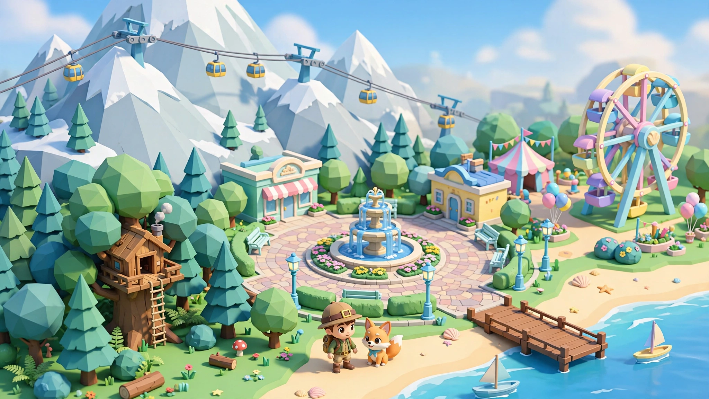

<div align="center">

# ✦ WonderWorld: Adventure City


**A 3D adventure game in the browser: explore six colorful regions as a little explorer with a pet companion — collect items, meet NPCs, play mini-games, and level up.**

</div>

## 🖼️ Preview



## 📌 What is this?

WonderWorld: Adventure City is a fully client-rendered 3D game built with **Babylon.js** on a **React + Vite + TypeScript** frontend. You play an explorer (with a follower pet) roaming a hand-built low-poly world with a day/night cycle. Progress — level, XP, coins, collectibles, unlocked regions — saves automatically to the browser.

## ✨ Features

- **Six explorable regions** — WonderTown, Adventure Forest, Sunny Beach, Sky Mountain, Fun Park, and Mystery Valley (gated until Level 10), each with its own theme, buildings, and landmarks
- **Third-person explorer** — WASD/arrow-key movement, jump, sprint, mouse-zoom camera, and touch controls (joystick + action buttons) on mobile
- **Pet companion** — a little pet that follows you around the world
- **15 NPCs** — walk up and press `E` (or Interact) to chat with characters like Mayor Mallow, Ranger Robin, and Captain Sunny
- **Collectibles** — coins, stars, shells, crystals, and gems scattered across regions; a 20-item world collection tracker
- **Quests, mini-games & daily goals** — quest log, 5 replayable mini-games with checkpoint timers, and a fresh daily-activity checklist
- **Character studio** — outfit looks, pets (9 companions), and a home-decor panel with 5 rooms
- **Progression** — XP/level system (up to level 50), Wonder Coins currency, 25 achievements, fast-travel world map
- **Dynamic world** — animated ferris wheel, spinning collectibles, bobbing NPCs, and a day/night sun cycle

## 🛠️ Tech Stack

| Tech | Role |
|---|---|
| React 19 + TypeScript | UI layer, game HUD, panels |
| Babylon.js 9 | 3D engine — scene, meshes, lighting, camera |
| Vite 7 | Dev server and build |
| Tailwind CSS v4 + Radix UI / shadcn | Styling and UI components |
| Framer Motion, wouter, sonner | Animation, routing, toasts |
| Express | Static file server for production |
| localStorage | Save file (`wonderworld-save-v2`) |

## 🚀 Getting Started

Requires [pnpm](https://pnpm.io) (the repo pins `pnpm@10.4.1`).

```bash
git clone https://github.com/hussnainahmedd/wonderworld-adventure-city.git
cd wonderworld-adventure-city
pnpm install
pnpm dev        # dev server on http://localhost:3000
```

For a production build:

```bash
pnpm build      # vite build + express bundle into dist/
pnpm start      # serves on PORT (default 3000)
```

**Controls:** `WASD` / arrow keys to move · `Shift` to sprint · `Space` to jump · `E` to interact · mobile gets a joystick + buttons automatically.

## 📂 Project Structure

```
wonderworld-adventure-city/
├── client/src/
│   ├── game/scene.ts        # The whole 3D world: regions, NPCs, player, systems
│   ├── components/
│   │   ├── GameCanvas.tsx   # Engine setup, HUD, and all side panels
│   │   └── Map.tsx          # Google Maps frontend integration helper
│   ├── App.tsx / main.tsx   # Entry points
│   └── index.css            # Tailwind + game UI styles
├── server/index.ts          # Express static server (production)
├── shared/const.ts          # Shared constants
└── assets/
    └── hero.webp            # Preview banner
```

## 📝 Notes

- Single-player and fully offline-capable once loaded — progress lives in your browser.
- Screenshots from an earlier session (`menu-screenshot.png`, `gameplay-screenshot.png`) sit at the repo root if you want a quick look at the actual in-game UI.

---

<div align="center">

Built by **Hussnain Ahmad** · [github.com/hussnainahmedd](https://github.com/hussnainahmedd)

</div>
